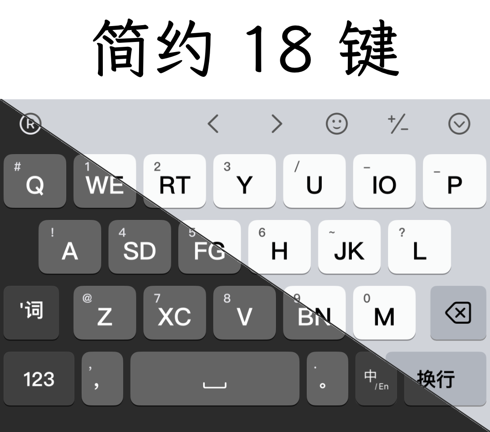

# rime-hamster-flypy-18keys

Flypy double-pinyin 18-key **schema** for Rime/Hamster:

- Rime schema: `double_pinyin_flypy_18`

## Repository layout

- `double_pinyin_flypy_18.schema.yaml`
- `ws14_18key.schema.yaml`
- `algebra_14_18key.yaml`
- `recipes/`
  - `flypy18.recipe.yaml` (Plum recipe entry)
  - `ws14-18-flypy18.recipe.yaml` (WuSong 14/18 schema, default Flypy+18)
- `skin/`
  - `hamster-18key-minimal/` (imported 18-key skin)
- `design/`
  - design/plan docs for iterative refinement
  - `design/skin-structure.md` (skin file structure and editing guide)

## Rime setup

### Option A: install via Plum (recommended)

```bash
bash rime-install calfzhou/rime-hamster-flypy-18keys:recipes/flypy18
bash rime-install calfzhou/rime-hamster-flypy-18keys:recipes/ws14-18-flypy18
```

### Option B: manual copy

1. Copy `double_pinyin_flypy_18.schema.yaml` into your Rime user directory.
2. In your own `default.custom.yaml`, add this schema to `schema_list`:

```yaml
patch:
  schema_list:
    - schema: double_pinyin_flypy_18
```

3. Deploy Rime.

## Hamster skin

Use any compatible 18-key Hamster skin, then select schema `double_pinyin_flypy_18`.
In this repo, `.keyboard` files are treated as generated cache and are not tracked.

### Demo



## 18-key design rule (current version)

- Shared keys: `WE RT IO SD FG JK XC BN`
- Single keys: `Q Y U P A H L Z V M`
- Shared keys send the **first letter** in keycap text.
- Rime `speller/algebra` adds derive mappings to accept second letters as the same key:
  - `e->w, t->r, o->i, d->s, g->f, k->j, c->x, n->b`
